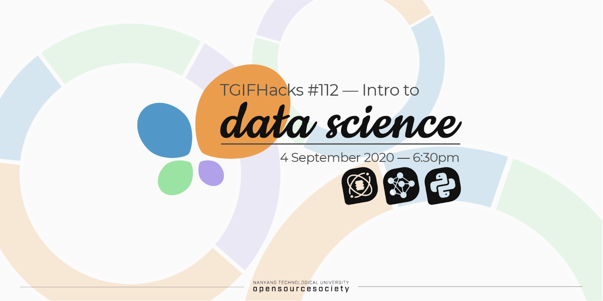

# NTUOSS-IntroDataScience-Workshop
# Introduction to Data Science 
</img>

# What is Data Science?
1. Have you ever wondered how Amazon, eBay suggest items for you to buy?
1. How Gmail filters your emails in the spam and non-spam categories?
1. How Netflix predicts the shows of your liking?

**Data science is all about using data to solve problems.**
## So, the core job of a data scientist is to understand the data, extract useful information out of it and apply this in solving the problems.

# Data Science Life Cycle:
1. **Problem Formulation:**
   Understanding the Business Problem and formulating it with Data
2. **Data Collection:**
   Collect the relevant Data that you wanted to solve the problem
3. **Data Cleaning/Quality Check:**
   Cleaning the datasets to ensure good quality data without errorneous data points
4. **Statistical Description:**
   To plot and solve for uni-variate and multivariate statistical points
5. **Exploratory Data Analysis:**
   Exploring Data with plots and understanding the distribution and other important information about the plots
6. **Machine Learning:**
   Creating Models on the Data to give some predicted value
7. **Statistical Inference:**
   Infer the statistical significance of your model and its performance,go back and create better models if required
8. **Decision Making:**
   Make Decisions backed by the Inferences from your model and data

# Problem Formulation:
## Most Data Science problems fall into the following categories:
- **Numeric Prediction:**
  Eg: How much sales should I expect this year
- **Classification:**
  Eg: Is this Email Spam or not?(Yes/No)
- **Detection of Structure within data(Clustering):**
  Eg: Can a company detect segments in its customers
- **Anomaly Detection:**
  Eg: Which products on the assembly line are faulty?
- **Intelligent Decision Making**
  Eg: Autonomous Cars
  
# Common Data Types
## Two Primary Data Types
1. **Structured Data**
   Highly Organized datasets
   1. Numeric - Numeric Continuous
   2. Categorical - Factor/Level/Class Variables
   3. TimeSeries - Numeric Variables with TimeStamps
   4. Network - Nodes and Connections
2. **Unstructured Data**
   Highly Unorganized and Contextual 
   1. Text
   2. Image
   3. Voice
   4. Video

